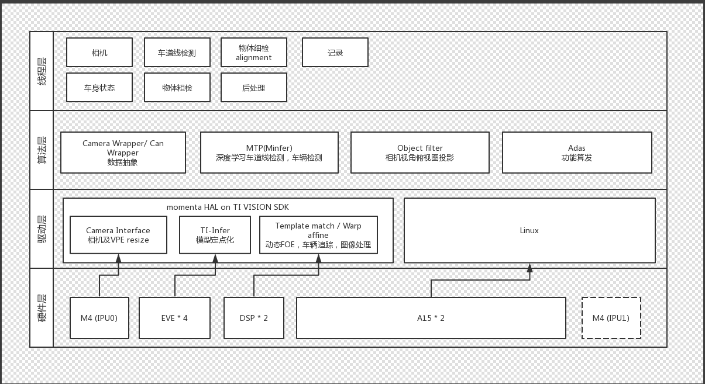
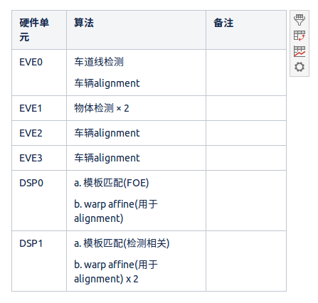

# 实习笔记

> 记录在momenta的学习

## Git

- `git submodule`----[git submodule命令](https://www.yiibai.com/git/git_submodule.html)

  - `git submodule add <https/ssh>`增加新的子模块

  - `git submodule update --remote <submodule_name> `更新子模块

  - 一般clone新仓库后，执行以下命令：

    ```bash
    git clone ${仓库} --recursive            # 1.在下载仓库时就递归下载
    git submodule update --init --recursive # 2.在更新仓库时递归更新
    ```

- `git lfs`待学

- `git config --global `配置全局的邮箱和用户，以后clone就不用输入用户名和密码

- `git branch <branch_name>`  创建分支

- `git checkout <branch_name>`切换分支

- 创建分支并且换到分支`git checkout -b <branch_name>`相当于一次性执行上述两条命令

- `git checkout <commit_num>`切换到某个commit的版本

- `git rev-parse HEAD`打印当前所处的commit号

- `git checkout`命令[详解](https://www.cnblogs.com/kuyuecs/p/7111749.html)

  - `git checkout -t <branch_name>`切换到对方分支
  - `git checkout <commit_id>`切换到某次commit后的结果

- 查看仓库所有分支`git branch -a vv`

- 查看当前所属分支`git branch -vv`

- 关于git push

  git push 在2.0以后不能再直接使用`git push`命令了`，一般使用如下命令：

  - `git push origin` 根据本地的分支push到对应的分支
  - `git push origin <分支1>:<分支2>`，将本地的某个分支push到远程的某个分支

- 关于回滚

  - 使用git revert
    - `git log` 可以看到commit号，然后选择自己需要撤销的commit_id
    - `git revert <commid_id>`，撤销某次commit的修改
    - `git push origin master -f`，将撤销操作更新到远程

### .gitignore规则不生效

解决方法就是先把本地缓存删除（改变成未track状态），然后再提交:

```shell
git rm -r --cached .
git add .
git commit -m 'update .gitignore'
```

## Docker

- 安装docker：`sudo apt install docker.io`
- 查找镜像：`sudo docker search <ubuntu>`
- 拉取镜像：`sudo docker pull <ubuntu>`
- 实例镜像为容器：`sudo docker run -i -t <ubuntu>`
- 退出容器：`exit`
- 提交容器修改，保存为新的镜像：
  - 当前容器不要退出，另开终端
  - 在新的终端中输入命令：`docker ps`
  - 在列出的容器中找到自己启动的容器，第一列是容器的id，记住自己要提交修改的容器的id
  - 然后执行`docker commit -m "提示信息" -a "作者名称" <docker_id> REPOSITORY:TAG `
  - 如果`REPOSITORY:TAG`和以前的一样的话，会覆盖以前的镜像
- 查看本地有的镜像：`sudo docker images`
- docker中出现中文乱码的情况，包括vim中文出现乱码，启动docker的时候在命令中加入选项：`env LANG=C.UTF-8`，我是在`/bin/bash`前面加入的

## GDB

1. CMakeLists文件里面前几行添加以下命令使得执行文件可以gdb调试

   ```cmake
   SET(CMAKE_BUILD_TYPE "Debug")
   SET(CMAKE_CXX_FLAGS_DEBUG "$ENV{CXXFLAGS} -O0 -Wall -g2 -ggdb")
   SET(CMAKE_CXX_FLAGS_RELEASE "$ENV{CXXFLAGS} -O3 -Wall")
   ```

2. 常用的流程：

   - `gdb <可执行文件>`   ---启动gdb
   - `list/l`  ---列出代码
   - `b <第多少行>`  ---在某行设置断点
   - `run`  ---程序运行到断点停止
   - `p <var>` ---打印出对应的变量信息
   - `c` ---继续运行

## Linux

- 文件传输：`scp <local_path> <hostname@ip:des_path>`
- `ssh hostname@ip`：ssh连接
- `CTRL + Z`：后在终端输入fg可以解决
- `ldd <可执行文件名> `：查看可执行文件依赖
- `file <文件名>`： 查看文件类型
- 查看操作系统和架构信息：`uname -a`
- 解压：
  - `tar -zxvf <filename> .`、`unzip <filename>`解压命令
  - `tar tvf Package_name.tar`查看压缩包内的内容
- 压缩打包：
  - `tar -cvf <×××.tar> <> <其他文件或者文件夹> ...`
- 搜索内容：`grep -r magic /usr/src`搜索目录下的mgic所在的行
- 创建软链：`ln -s <文件实际目录> <链接的名字>`
- 修改软链：`ln -snvf <新的目录> <软链名字>`
- 查看磁盘使用`df -h`
- `echo <string>`输出字符串
- `echo <string> <file_path>`字符串输入到文件中
- `ls`用法
  - 统计文件夹下文件的个数`ls -l |grep "^-"|wc -l`
  - 统计某文件夹下目录的个数`ls -l |grep "^d"|wc -l`
- `du 用法`
  - `du -sh <dir_name>`查看文件夹大小
- 添加执行权限`chmod +x <filename>`
- 设置用户环境变量：
  - 在用户的根目录下`vim .profile`
  - 在最后添加`export PATH="目标目录:$PATH"`
  - 保存退出后，然后执行`source ~/.profile`
  - `echo $PATH`打印环境变量
- 查看文件夹大小：
  - `du -m`以MB为单位
  - `du -h --max-depth=1 .`查看当前文件夹下所有文件和文件夹的大小
  - `ls -l`可能可以
- linux查看显卡信息`lspci | grep -i vga`
- linux英伟达GPU信息`lspci | grep -i nvidia`
- 查看文件前几行内容：`head <file_name>`
- 查找当前目录下文件或者目录`find . <file/dir name> `

### vim

- 命令行模式下：`gg=G`代码格式化
- 命令行模式下，直接写数字可以换行
- 替换文档中所有单词`%s/<ori_word>/<new_word>/g`
- vim支持clipboard以后，使用`"+P`在vim中粘贴系统剪贴板的东西

## mtp-release使用及阅读笔记

> 修改CMakeLists.txt中，手动设置CUDA版本为8.0，使用master分支编译成功。其他分支代码未知，测试多个分支均未成功，就算编译成功了，sample也运行失败，错误码普遍为9。

**很老了，去年九月份的!!!!!!!!!!!!!!!!!!!**

**使用最新的需要切换到autodev分支**

运行sample注意事项：

- 使用命令`./sample -m <model_path.tar> -c <config.json> -i <image_path> -o <output>`
- `config.json`指的是tar文件里得到config文件名，不需要指定路径
- 模型(tar文件)的类型一定要和sample(看名字)对应上，不然会出错，我也不知道为什么什么错误代码都是9
- 模型需要使用对应平台的模型，根据1v1r-resource的分支进行切换，获取对应平台得到模型

### 测试用例sample使用

#### 车辆检测

1. sample_car_detect，直接调用`MTP_car_detect()`接口，会直接输出精检测后的结果或者更多包含其他更多的信息
2. sample_car_detect_rect，调用`MTP_car_detect_rect()`接口，会输出粗检测后的结果
3. sample_car_detect_align，先调用`MTP_car_detect_rect()`接口，然后调用`MTP_car_detect_align()`接口，前者的结果作为后者的输入参数

## model-benchmark

### gt文件和dt文件相关

#### object_detect

```
x1 y1 x2 y2 hide track_id score gt_type category_id
635.882874889 628.944360902 745.184700883 717.623200859 0 0 1 0 1  -- gt
0.0 627.554016113 358.141571045 833.258666992 0 0 0.999740421772 255 1 -- dt
```

#### lane_detect

暂时不知道

**转化后的json**

```json
{
    "Lines": [
        {
            "end_pos": 28, 
            "cpoints": [
                {
                    "y": 287, 
                    "x": 39.122642517089844
                }, 
                {
                    "y": 283, 
                    "x": 44.481657365499984
                }, 
                {
                    "y": 279, 
                    "x": 49.834190320866185
                }, 
                {
                    "y": 275, 
                    "x": 55.180485540326629
                }, 
                {
                    "y": 271, 
                    "x": 60.520648722561418
                }, 
                {
                    "y": 267, 
                    "x": 65.855110258374225
                }, 
                {
                    "y": 263, 
                    "x": 71.184110361623709
                }, 
                {
                    "y": 259, 
                    "x": 76.507774249433453
                }, 
                {
                    "y": 255, 
                    "x": 81.826502272291748
                }, 
                {
                    "y": 251, 
                    "x": 87.14053919465789
                }, 
                {
                    "y": 247, 
                    "x": 92.450012962610458
                }, 
                {
                    "y": 243, 
                    "x": 97.755304216333627
                }, 
                {
                    "y": 239, 
                    "x": 103.05665713221742
                }, 
                {
                    "y": 235, 
                    "x": 108.35422192931895
                }, 
                {
                    "y": 231, 
                    "x": 113.64833823835147
                }, 
                {
                    "y": 227, 
                    "x": 118.93925617137842
                }, 
                {
                    "y": 223, 
                    "x": 124.22715557725786
                }, 
                {
                    "y": 219, 
                    "x": 129.51232989344987
                }, 
                {
                    "y": 215, 
                    "x": 134.79503783285918
                }, 
                {
                    "y": 211, 
                    "x": 140.07548441762555
                }, 
                {
                    "y": 207, 
                    "x": 145.35392670565557
                }, 
                {
                    "y": 203, 
                    "x": 150.63062850147134
                }, 
                {
                    "y": 199, 
                    "x": 155.90581329191144
                }, 
                {
                    "y": 195, 
                    "x": 161.17971628704981
                }, 
                {
                    "y": 191, 
                    "x": 166.45260037453315
                }, 
                {
                    "y": 187, 
                    "x": 171.7246992482691
                }, 
                {
                    "y": 183, 
                    "x": 176.99624411895161
                }, 
                {
                    "y": 179, 
                    "x": 182.26748915784574
                }
            ], 
            "points": [], 
            "properties": {
                "lane_type": [
                    "normal_lane"
                ]
            }, 
            "start_pos": 0
        }, 
        {
            "end_pos": 26, 
            "cpoints": [
                {
                    "y": 287, 
                    "x": 419.02053833007812
                }, 
                {
                    "y": 283, 
                    "x": 413.66529538303621
                }, 
                {
                    "y": 279, 
                    "x": 408.3062822578766
                }, 
                {
                    "y": 275, 
                    "x": 402.94363673694909
                }, 
                {
                    "y": 271, 
                    "x": 397.57742219678801
                }, 
                {
                    "y": 267, 
                    "x": 392.20788969665961
                }, 
                {
                    "y": 263, 
                    "x": 386.83516818528841
                }, 
                {
                    "y": 259, 
                    "x": 381.45935769617984
                }, 
                {
                    "y": 255, 
                    "x": 376.08068657868148
                }, 
                {
                    "y": 251, 
                    "x": 370.69927582884156
                }, 
                {
                    "y": 247, 
                    "x": 365.31526035502173
                }, 
                {
                    "y": 243, 
                    "x": 359.92884601379097
                }, 
                {
                    "y": 239, 
                    "x": 354.54014843381276
                }, 
                {
                    "y": 235, 
                    "x": 349.14933209751223
                }, 
                {
                    "y": 231, 
                    "x": 343.75657227987119
                }, 
                {
                    "y": 227, 
                    "x": 338.36201206415143
                }, 
                {
                    "y": 223, 
                    "x": 332.96582767891738
                }, 
                {
                    "y": 219, 
                    "x": 327.56813801574856
                }, 
                {
                    "y": 215, 
                    "x": 322.16914531952551
                }, 
                {
                    "y": 211, 
                    "x": 316.76899490087027
                }, 
                {
                    "y": 207, 
                    "x": 311.36783418183484
                }, 
                {
                    "y": 203, 
                    "x": 305.96584410371031
                }, 
                {
                    "y": 199, 
                    "x": 300.56317106972705
                }, 
                {
                    "y": 195, 
                    "x": 295.15997799166064
                }, 
                {
                    "y": 191, 
                    "x": 289.7564305378869
                }, 
                {
                    "y": 187, 
                    "x": 284.35268294039855
                }
            ], 
            "points": [], 
            "properties": {
                "lane_type": [
                    "normal_lane"
                ]
            }, 
            "start_pos": 0
        }
    ], 
    "properties": [], 
    "size": {
        "width": 512, 
        "height": 288
    }
}
```

```json
{
    "Lines": [], 
    "properties": [], 
    "size": {
        "width": 512, 
        "height": 288
    }
}
```

- Lines：记录每条车道线的信息
  - end_pos：应该是对应车道线的最后一个点的下标，或者说就是车道线标记出点的数量
  - end_pos：车道线对应列表的第一个下标
  - points：都是空，不知道是什么
  - properties：该车道线得到一些属性
    - lane_type：车道线类型
- properties：图片某些属性，一直为空，猜不出来
- size：图片大小

据此猜测的模型运行得到的文本信息格式：

```
图片基本信息（图名 图高 图宽）
车道线信息（properties x1 y1 x2 y2 x3 y3 start_pos end_pos）
车道线信息
。。。

图片
车道线信息
车道线信息
。。。
```

### MomentaEvaluator变量介绍

- cocoDt.dataset中记录测试结果的相应参数，是一个字典类型
  - dataset['img']中记录了每张图片的基本信息，包括图片名、尺寸、id
  - dataset['annotations']中包括所有检测到得到车位置信息，还有评测后的打分信息
  - dataset['categories']中包括了本数据集的信息，比如是否包括了车、人等物体
- cocoDt.imgToAnns中记录了所有图片中检测出的车信息，是一个列表类型
  - 每张图片下面同样也会有一个列表，就是检测出的所有车的车身信息
  - 每个车的车身信息是一个字典类型
  - 下面包括了所有的需要的信息
- cocoGt的相关数据类型同上，区别就是imgToAnns和dataset['annotations']中的score中都是1，因为是真值

### 原ti-benchmark的run.py运行流程

> 此前需要把模型文件按照README中的要求放到特定的路径里

1. 解析参数，主要是得到本地的模型路径，本地的gt、dt文件路径，结果输出的路径。远程模型的运行脚本路径需要自己去指定，包括板子地址，脚本路径
2. 首先会检查本地模型路径是否存在，因为这个路径不仅存放模型，还要放置传回的quant.txt文件，如果没有这个文件夹的话，会自动创建
3. 如果程序发现本地没有quant.txt文件，说明远程还没传回测试结果，所以需要从远程拉取quant.txt文件
4. 如果远程也没有quant.txt文件，说明模型没有运行，所以得在远程运行模型获取结果文件，所以会执行远程模型运行函数
5. 如果参数中指定了要强制重新运行模型，则无论quant.txt文件生没生成，都会让远程的模型重新运行得到结果
6. 最后就是将quant.txt文件和gt.txt文件作对比，评测结果，这里需要借助到MomentaEvaluator模块
7. 目前并不知道粗检测的结果中，除了score外，其他几个怎么填

### AlignP3DDriverImplV3::predict()源码

#### 变量

- `images`是一次输入的图片序列，`car_rects`是一次输入的车的框数据
- `result`存放最终结果，`size_per_batch`在模型配置文件中指明的(6 × 1)
- `net_input_batch_`应该就是1
- `sub_batch_size`是当前处理的图片序列长度和指定拼接长度(6)的较小值，也就是如果粗检测传入8张图，那`sub_batch_size`就是6，如果粗检测传入4张图，那`sub_batch_size = 4`
- `sub_batch_images`就是当前批次处理的`sub_batch_size`张图，从`images`中顺序导入
- `padding_size`是填入图片序列以后，这批次还剩的空间，比如粗检测后传入4张图，则还剩2

#### 函数过程

- `sub_batch_car.insert(sub_batch_car.end(), padding_size, sub_batch_car[0]);sub_batch_images.insert(sub_batch_images.end(), padding_size, sub_batch_images[0]);`
  - `sub_batchc_car`中存放之前传入的车框信息，`sub_batch_images`存放传入的图片信息
  - 如果不够(6)张的话，会用第一张图强行补全剩下的空间，所以传入检测得到始终是6张图和6个框
- `sub_batch_car.insert();sub_batch_images.insert()`会把第一张图和第一个框去补全成6个
- `prepare_input()`对预测输入的数据进行预处理
- `net_->run();`
- `process_output()`将预测后的数据输出
- `process_output.erase()`擦除之前多余的用第一个MTPCar填充的信息
- 也就是一开始传入多少个框，最后返回result中就有多少个精检测数据，不会多也不会少

### TDA2SX的不同计算单元和使用





- 4个EVE，进行Alignment的时候用的是EVE进行计算，配置文件config可以控制，比如使用第一个EVE对应的就是`car.core0.json`
- 两个CPU，用两个线程，并将线程绑定到不同得到CPU上可以让CPU占用率达到50%以上
- 两个DSP，进行仿射变换会使用DSP（没使用过，存疑）

### TDA上测试A15占用率

打印所有cpu占用率，1秒钟采集一次，一共10次，统计出平均值。

`mpstat -P ALL 1 10`

### 查看CPU温度

`cat /sys/class/thermal/thermal_zone0/temp`

### 问题记录

1. 打印日志中出现IndexError('list index out of range',)错误

   问题出在`/object_detect/bench_code/pycocotools/cocoeval2dbox.py`的第488-508行，`np.searchsorted(list1, list2, left)`函数是指在list1中找list2的值，并返回对应的下标，left指的是对于list2中的每个数，在list中找到刚刚好超过当前数的第一个下标，但是如果说比所有数都大的话，就会出现下标大于等于list1长度的情况。

   目前得到解决方案：将报错注释掉。。。
   
2. 无法使用1v1r-resource下的模型

   对应平台的perception或者mtp-release就得使用对应平台的模型，1v1r-resource上的master下的模型是x86的，42和92的仓库里都是tda板子arm上的。

3. 计算后发现分数特别低？？？

   找到原因是，送给评测IoU的图片序列必须一一对应，第三方评测程序并不会对dt和gt的输入进行唯一对应，这件事需要在之前就做好。
   
4. 交叉编译的时候出现无法找到opencv_world的问题？

   发现路径不一样，一个是armv7l，一个是armv7，要使用对应版本的mkenv.py进行交叉编译，armv7l需要带参数 `--platrom tda`。

5. 出现头文件和库版本不对应的情况：*[ERR][MTP] Header version(1.1.8) is not compatibile with library version(1.2.0).*

   交叉编译的时候指定版本，在mkenv时加上`-DSDK_VERSION=$版本号`的参数，make以后还需要install，并将安装后的.so文件拷贝到tda板子上，具体查看[模型相关](https://confluence.momenta.works/pages/viewpage.action?pageId=33210036)。
   
6. 1v1r-resource的tda分支下没有car的模型

   直接选用object.tar文件，但是使用相应配置文件，如car.core0.json。

7. 在tda上面运行的程序得添加hal头文件，进行环境初始化等，但hal模块不存在的问题？（symbol lookup error: ./libperception.so: undefined symbol: hal_modl_malloc_continuous_aligned）

   直接把1v1r-perception的thirdparty下的hal-release拷贝到sample文件夹下，和opencv一个目录，在sample下的的CMakeLists中需要`add_subdirectory(hal-release)`，并将可执行文件链接到hal的库中，因为在hal下的CMakeLists.txt中project(mhal)命名为mhal，所以添加`target_link_libraries(${SAMPLE_NAME} mhal)`。

8. 出现*No rule to make target '../sample/hal-release/../ti-system-lib/usr/lib/librt.so', needed by 'sample/car_align'.*错误？

   这是因为一些库找不到，将1v1r-perception中的ti-system-lib文件夹拷贝到sample文件夹下就行了。

9. 在tda上运行时报错：[ERR][MTP] Detector does not exist, unable to process.Error: 10？

   tda上已经不存在car.tar模型文件了，需要全部改成object.tar的，同时粗检测使用的也是object_detect的接口，而不是car_detect_rect的接口了。

   - **在tda上，精检测的模型配置文件选用car.core0.json**
   - **在x86，精检测的模型配置文件选用config.car.v1.json**
   - **粗检测，两个平台都是config.normal.json**

10. 出现illegal instruction错误

    经过测试，发现在函数中，如果将回传参数vector类型变量作为引用传入函数，在x86上正常，在arm上会报illegal instruction错误；如果是在函数内部生成新的vector返回，就是正常的。经过骏铮指导，如果在调用函数前使用reserve提前分配空间，且空间无论分配多大，就是正常的。。。贼诡异！！！！

11. 读取粗检测输出文件作为精检测输入的时候，会出现missing rect的错误

    其实是因为精检测输入不仅需要框的信息和识别的置信度score，还需要可靠性available，详见perception中提供的API文档。

12. 在arm上出现段错误，但不会影响程序结果，也不会造成系统崩溃。

    参考：[arm-linux-gdb在调试core dump文件的用法](https://blog.csdn.net/ywyywyywy/article/details/21076575)生成coredump文件，然后用gdb调试。

    - 执行gdb <可执行文件> <core_dump文件>
    - 会出现：`#0  0xb6b8adc4 in CvType::~CvType() () from ./libperception.so`  ---指出错误的位置
    - 把其他都注释掉，只留下`#include "opencv2/opencv.hpp"`一行，也会出现段错误，同时把`#include "opencv2/opencv.hpp"`以及`#include "sample_drawer.h"`注释掉，就不会出现段错误
    - 综合前面的发现，可以确定段错误应该出现在`#include "opencv2/opencv.hpp"`中
    
13. perception编译成的库不打印时间log。

    添加编译选项`../mkenv.py --platform armv7 -DSDK_VERSION=1.1.8 -DFLC_PROF=ON`

### 交叉编译

> 参考[构建ARM Linux交叉编译工具链 详解](https://blog.csdn.net/hailin0716/article/details/17578767)

交叉编译就是在一个平台上编译出能在其他不同体系结构的平台上运行的程序。

### 交叉编译工具链及使用方法

**使用方法**

- cd到tda-server下
- 修改CMakeLists.txt，主要是添加命令`add executable(exe_name, *.cpp)`
- 然后`mkenv.py --platform tda`，会将整个项目都执行交叉编译
- `file exe_name`可以查看可执行文件运行平台
- 编译完以后还需要`make`一下
- 添加编译选项
  - `-DSDK_VERSION=1.1.8`，设置生成库的版本
  - `-DFLC_PROF=on`，打开一些提示信息
    - `python ../mkenv.py --platform armv7 -DSDK_VERSION=1.2.4 -DFLC_PROF=on`

### 固件更换方法

将1v1r-perception下/thirdparty/hal-release/firmware/linux-tda2sx/下的东西拷贝到对应板子上的/lib/firmware/下进行覆盖。

Tips：1v1r-perception下的firmware一定要使用对应的分支。

## CMake

### 添加功能

**在cmake中添加，生成的可执行文件可以用gdb调试**

```cmake
SET(CMAKE_BUILD_TYPE "Debug")
SET(CMAKE_CXX_FLAGS_DEBUG "$ENV{CXXFLAGS} -O0 -Wall -g2 -ggdb")
SET(CMAKE_CXX_FLAGS_RELEASE "$ENV{CXXFLAGS} -O3 -Wall")
```

### 提示undefined symbol: 

根据我那次的检查发现是头文件和源文件没有链接到一起，比如这次感知增加了新的ofo，我已经把include整个拷贝过去了，但是cmake编译库的时候，没有把ofo的源文件添加一下。

```cmake
...
add_subdirectory(src/ofo)
...
perception_ofo
```


## ZeroMQ学习

待

## Others

### dbc

- generator生成.h和.cpp文件
- 然后移动到dbc_module中

### Can-Hub

- input，获取输入数据并文本解析，包括socket和文本输入
- 解析
  - can_parser解析文本，根据dbc的id去调用对应的dbc_module生成的h和cpp文件
  - protobuf会根据carstate.proto的配置信息生成对应的h和cpp文件，用来序列化和反序列化
- output：反序列化换成字符串，再根据情况输出
  - 将车信息转成json格式，然后保存到文件中
  - 将车信息直接发送给客户端

### TDA-Server

> [Gitlab](https://gitlab.momenta.works/1v1r/tda-server)

### tmux

- 启动双屏
  - `tmux`
  - `Ctrl + b`
  - `shift + '`/`shift + %`
- 切换屏幕`Ctrl + b`，然后上下切换
- 使用光标滑动屏幕
  - `Ctrl + b`
  - `[`
- 切换到命令输入模式`q`
- `tmux -s new <your_name>`

### SSH

- 创建SSH-Key：`ssh-keygen -t ed25519 -C "email@example.com"`
- 查看本地的公钥
- `cd ~/.ssh`
  - `cat id_rsa.pub`
- 将公钥复制到自己的`Github/Gitlab`中

### 评测流程

> [参考](https://confluence.momenta.works/pages/viewpage.action?pageId=34997769)

#### 集成后运行

1. 在服务器61上用docker环境拉取新的1v1r-perception仓库，记得用递归命令以便于克隆下子模块
2. 使用脚本`./scripts/compile-armv7-release.sh`编译，会生成`build_ti`文件夹
3. `./build_ti/install`下面的lib、bin文件夹（可能还有include、firmware等文件）需要拷贝到服务器42/92上的`/run/media/sda1/fvp_sandbox/`中
4. 每个包的json配置文件都放在`/run/media/sda1/fvp_sandbox/config`中，92中有222个包，42中有20个包
5. 在`/run/media/sda1/fvp_sandbox/tools/transfer-json/`文件夹中，有很多配置文件，一般我们做小规模测试的时候用`test.json`，大规模的时候用`transfer_222.json`
6. 也就是在目录`/run/media/sda1/fvp_sandbox/tools/`下，首先执行`python run_all.py -s 1`清除结果，然后执行`python run_all.py -j ./tools/transfer-json/<test.json或transfer_222.json> -c ti_config.json`跑结果
7. 结果会出现在`perception-result`中，对应的数据包跑的结果会保存在对应的文件夹中，比如a3_8数据包跑的结果就会保存在a3_8文件夹中

#### 使用Benchmark评测结果

1. ssh登录61服务器，然后`cd ~/liuhaoxu`
2. 执行脚本`./auto_benchmark.sh`，进入评测后的docker
3. 进入结果保存的目录`cd /data4/tda_res`，将前面运行后的结果拷贝到当前目录，拷贝前务必将以前的结果删掉（`rm -rf *`）
4. 进入到工作目录`cd /data4/workspace/`，启动转换程序`python tools/perception_convert.py --mid_dir /data4/TestCases/MidData/ --log_dir ../tda_res/ --type tda_0621`，这里要把0621改成当天评测的日期，会根据这个日期会把转换后的结果存储在对应的文件夹中，打印得到日志里会显示
5. 进入到benchmark工作目录`cd /data4/workspace/1v1r-benchmark`
6. 启动评测程序`python AutoBenchmark.py -c momenta_tda_0621_20190621****`，其中`momenta_tda_0621_20190621****`就是之前结果转换成json文件的目录
7. 最后评测的结果会出现在`/data/workspace/benchmark-result`中，根据设置的对应的日期名称会有对应的文件夹

   #### C/C++相关

- 头文件声明接口，源文件会被打包成动态或者静态库，这样的版本叫做发布（release）版本
- linux段错误重定向：`{ 可执行文件; } 2>err.txt

./sample_ofo_detect_align  -i ofo_pictures/20170906_day_cloudy_downtown_anc50%2017-07-16-19-05-58000018%170%634%325%783.jpg -m models/object.tar -c ofo.core0.json -o out.jpg